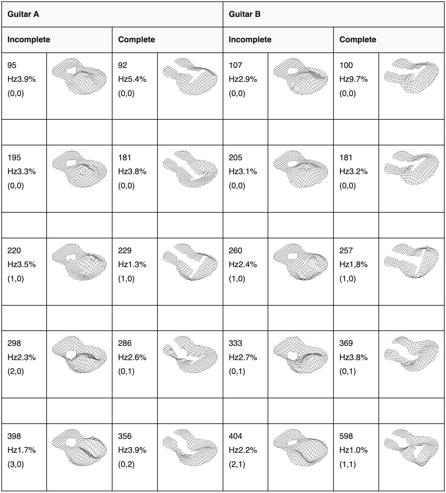
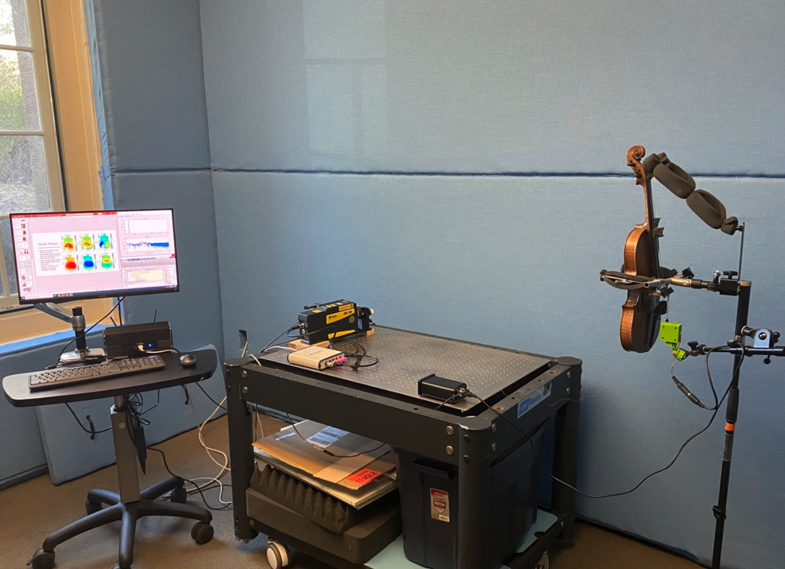
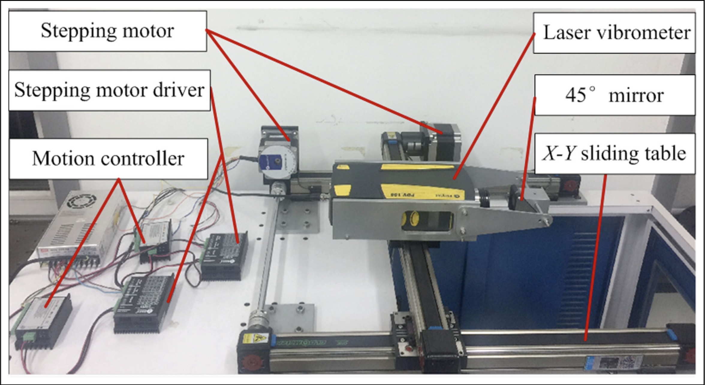

<figure id="fig:mode-shape">

</figure>

# Overview

Modal analysis provides an understanding of an object’s frequency
response, vibration patterns through mode shapes , and can also provide
a means of estimating material properties . Risk to an instrument is
prominent concern during analysis, in particular to historic musical
instruments. This has lead to the emergence of non-contact methods for
measuring vibration. These new methods are appealing for modal analysis
for fragile or expensive instruments.

Laser vibrometry has long been a useful tool for acoustic analysis ,
especially with respect to musical instruments . There are two main
methods for detecting the vibrations of an object using lasers. There is
the interferometry, based on interference of lasers, or velocimetry
based on the doppler shift of a single laser. Laser vibrometry provides
a non-contact means of obtaining accurate results and is a preferred
method for analysis of musical instruments, however it does have a
limitation in the form of cost .

A modest Laser Doppler Vibrometer (LDV) cost in the order of €20k. In
addition, estimation of material properties of soundboards comes with an
additional cost of Finite Element Method modelling software. This is a
cost that is difficult to justify for the usage it would see by
instrument collector and museums. The market for laser vibrometer is
also dominated by a handful of companies and it seems unlikely this cost
will shrink any time soon. Laser vibrometers are precision engineered
for all vibration analysis, a level accuracy unlikely to be utilised
when applied to musical instruments.

This cost is only for a fixed LDV, an even larger cost is incurred for a
scanning LDV. Unlike an LDV, which must be adjusted manually to a new
target, a scanning LDV can automatically focus to a new target. The
benefits of automating the measurement process for modal analysis are
two-fold. Firstly, automation would allow the entire process to take
place with minimum manual intervention, saving time in labour and
potentially time in carrying out measurements. Secondly, an automated
process would make measurements more easily reproducible. Multiple
rounds of measurements could be taken and the accuracy of the
experimental setup could be more easily tested. The project aims to
explore viable, affordable and reproducible means for augmenting a laser
vibrometer to a scanning laser vibrometer.

<figure id="fig:ldv-setup">

<figcaption>LDV Measurement Setup in </figcaption>
</figure>

The thesis by Malah outlines such a system for a Grazing Laser
Vibrometer. The proposed project would expand Malah’s work by applying
it to a Laser Doppler Vibrometer. In addition, the project will explore
automating the process of measurement and provide an open source
framework for analysing result.

The barrier to entry for technical projects of this kind has been
lowered over the past few decades. What was once quite a technical
undertaking is now more achievable with readily available
micro-controller units (MCU) like the Arduino or single-board computers
(SBC) like the Raspberry Pi, which can easily interface with sensors and
actuators to prototype haptic devices. This proposal will cover what
components will be required in the project and what function they will
serve.

<figure id="fig:guitar-mode-table">

<figcaption>Table of guitar body mode shapes derived from LDV in </figcaption>
</figure>

# Recent Research

This section will discuss some projects from the last 15 years focused
on the topics of laser vibrometry and its application in musical
acoustics. There will also be review of recent research into low-cost
fabrication of laser vibrometers and and economic methods to implement
automated scanning systems for laser vibrometery. I will then elaborate
on how the proposed project intends to enhance and build on those
projects that have come before.

## Low Cost Non-Contact Vibration Measurement

Matiss Malahs researched building a low-cost laser vibrometer system for
a PhD thesis . The thesis is an overview of interferometry, LDVs and
Grazing Laser Vibrometers (GLV) as well as an instruction on fabricating
a GLV economically. This project would expand on Matiss’s work by
exploring the construction of both affordable LDV and GLV measurement
units, in particular with an application to soundboards. Measuring
musical instrument soundboard does not require as wide a frequency
bandwidth compared to other vibration analysis applications. The Polytec
PSV400 has bandwidth up to 1000kHz , compare to soundboards where only
up to 20kHz are consideration for measurement as it is the limit of
human hearing.

One of the main applications for scanning instruments is the ability to
cross-reference results with those obtained within simulation.

Laser vibrometry and its application and practicalities within the field
of musical acoustics is still actively being explored, but it is not the
only method of non-contact measurement of musical instruments. An array
of MEMs microphone has been considered as an option for non-contact
economic modal analysis. This is a promising approach for obtaining FRFs
as outlined in and may be accurate enough for estimating material
properties. MEMs microphone arrays as a means of plate mode measurement
is demonstrated in not to be accurate.

Since the focus of the project is on the derivation of mode shapes, as
well as mode frequencies, the usage of MEMs microphone arrays has not
been considered.

## Laser Vibrometry for Musical Acoustics

<figure id="fig:rau-setup">

<figcaption>Scanning LDV setup used in </figcaption>
</figure>

In the paper by Tahvanainen et al. the measurements of eight guitars was
required, one using laser vibrometery, in order to obtain an aggregate
set of of mode shapes and top plate velocities. In this case research
place at Yamaha Research and Devlopment and is a best case scenarion
with respect to acces to materials and tools. Similarly, measured guitar
mode shapes and frequencies for comparison with those of a finite
element model. Low cost laser scanning vibrometer would lower the
barrier in both cost and labour for projects of this kind making it more
accessible.

The paper by Le Moyne provides an example of when non-contact
measurements are essential in musical instrument restoration. In this
case a 17th century Couchet harpsichord was to be reconstructed. In this
case a near-field acoustical holography approach was taken. This was to
avoid the need for use of an impact hammer. Less intrusive methods of
excitation are available, such was used in where a non-invasive
excitation was achieved using random noise in a speaker. The project
would aim to provide a readily available tool for musical instrument
collection to use for the monitoring and restoration of musical
instruments.

## Low Cost Scanning Laser Vibrometry

All the projects that use laser vibrometry in section
<a href="#lv-for-music" data-reference-type="ref"
data-reference="lv-for-music">2.2</a>, utilised scanning laser
vibrometers. A scanning LDV is typically in the price range of £100k as
opposed to £30k for a non-scanning LDV. The scanning LDV drastically
reduces labour as the need for repositioning the LDV is bypassed
entirely. The project aims to develop further methods that have been
used in recent researched for obtaining an affordable method to augment
an LDV into a scanning LDV.

The paper of Hui et al. considers the addition of a linear scanning unit
paired with a laser vibrometer. In this paper high-resolution results
were obtained with a XY sliding table. A sliding table can be sourced
for a relatively low cost and is therefore within the scope of an
affordable linear scanning assembly.

Linear scanning using a standard two-dimensional plotter yielded
high-resolution results in . Such a measurement arrangement would allow
for automated scanning. The 3D printed impact hammer used for
measurements in can also be combined with an actuator (e.g. a solenoid)
for reproducible excitation.

<figure id="fig:ldv-linear-scanner">

<figcaption>LDV Mounted to plotter (labelled X-Y sliding table) </figcaption>
</figure>

One large draw back of the approach in the paper by Hui et al is in
scaling the project. For the soundboard of an instrument such as a
violin or a guitar the scale of the sliding table assembly is relatively
low cost and achievable. If a piano or harpsichord sound board is to be
considered the material costs and labour cost in assembly are not
insignificant.

<figure id="fig:mirror-galv">
<embed src="./img/mirror-galv.pdf" style="width:66.0%" />
<figcaption>Setup of mirror galvanometer pair from  illustrating how rotation of
mirrors translates to project onto a 2D plane</figcaption>
</figure>

Another interesting approach to automated scanning would be through the
use of mirror galvanometers. A mirror galvanometer consists of a mirror
attached to a rotating spindle on its central axis. The spindle is
attached to an assembly similar to that of a stepper motor. The degree
of rotation changes depending on the voltage applied to the internal
circuit. This arrangement allows for a laser beam to be aimed at a point
on a 2 dimensional plane using the rotational movement
<a href="#fig:mirror-galv" data-reference-type="ref"
data-reference="fig:mirror-galv">6</a>. A common modern commercial
application for a pair of mirror galvanometers to be used with a laser
is in animated laser light displays. Given this commercial use, mirror
galvanometers can be sourced for an economic cost.

The benefit of using mirror galvanometers a means of creating a scanning
LDV is that they would address the problem of scaling to larger
soundboards. In order to scan a larger area, the laser can simply be
moved further away from the soundboard. The mechanical travel is also
less in comparison to the sliding table, meaning scanning time would
also be reduced. Such a system was used in the thesis by Rau to
successfully measure the soundboard of a guitar. One limitation of
digitally controlling a mirror galvanometer is number of potential
points that can be measured. The bit-depth of the digital to analog
converter (DAC) that is used dictates the number of available grid
points. In the thesis by Rau a 12-bit DAC was used, which provides a
4096 x 4096 grid of points that can be measured. A grid of that size
would be sufficient for a guitar or violin top plate, but in order to
accommodate larger soundboards, such as for piano or harpsichord, it
would be beneficial to select a DAC with a higher bit-depth.

# Project Description

The project aims to to look at two types of laser vibrometry methods.
The goal of the project would be the design of an automated non-contact
measurement system for musical instrument soundboards. The system would
aim to be economic to fabricate in comparison to current commercially
available laser vibrometers.

- Laser Doppler Velocimetry

- Grazing Laser Vibrometry

Each method has a base cost for the most simple instance, with extra
costs incurred from components with high tolerance and signal filtering.

<figure id="fig:laser-block">

<figcaption>Block Diagrams of both LDV and GLV from </figcaption>
</figure>

The initial step of the project would be to construct at the simplest
version for each vibrometer and test its accuracy. Depending on results,
the fabrication can then be refined or a second version can be created
with higher quality components. The benefits provided from these
components can be quantified against their cost and documented.

The project would focus on the creation of an open source, version
controlled framework for designing a low-cost, non-contact measurement
system for musical instrument soundboards consisting of:

- Operation Manual Repository: An open source repository containing:

  - Instructions for self-assembly of measurement tools and experiment
    setup

  - CAD models for digital fabrication of components and PCB

  - Control software for automation of a measurement rig

  - Analysis software for recording, processing and analysing
    measurement data.

- Technical Documentation: A document containing: , justification of
  design decisions, discussion of formulae required to obtain detain
  from the system,

  - An outline of the design process

  - Technical background and justifications for any design decision and
    components utilised

  - Design modifications, their relative cost to the project and impact
    on results.

### Materials

Listed below are materials the materials required categorised by their
function with a brief explanation of their purpose within the greater
project. With respect to costing, all prices given are an aggregate of
relevant suppliers recorded on

. Suppliers used are listed before each section. Guide prices here a
listed to give a rough costing and do not include additional costs such
as customs and shipping. In some cases there could also be a decrease in
price when buying multiple units.

#### General electronics

The proposed project will require a workshop space with facilities
applicable to all approaches of measurement techniques. In addition to
access to general electronic sundries (resistors, capacitors,
potentiometers), a workshop would require facilities to aid prototyping.
Suppliers RS and Element 14 were used as a source for guide prices:

- Bench Power Supply: Parametric power supply required for prototyping
  electronics when power requirements are still in flux. (Guide Price:
  £125)

- Function generator: For applying a functional signal to a circuit for
  simulating input from sensors. (Guide Price: £160)

- Oscilloscope: Signal measurement and testing. (Guide Price: £160)

- Soldering Station: For soldering though-hole and surface mount
  components. (optionally) A reflow oven for soldering surface mount
  components to a pcb. Alternatively this step could be carried out from
  an external service. (Guide Price: £150)

#### Laser Components

Components relevant to each vibrometer type are listed below. Suppliers
RS and Element 14 were used as a source for guide prices:

- LM348 op-amps: used in the Transimpedance Amplifier as well as
  filtering circuits, and level shifting. As recommended in an
  alternative would aso be sought to improve sensor bandwidth. (Guide
  Price: £0.70)

- 650nm Laser: Bandwidth chosen in to match the BPW34 photodiodes. The
  BPW3 is shown to have the best response in the Infrared range so a
  dual laser system, one for aiming one for measuring, would be
  desirable. (Guide Price: £20)

- BPW34 photodiodes: Used for detecting changes in the laser beam.
  Current is induced when the light strikes the surface. (Guide Price:
  £0.80)

- Analog to Digital Converter: The GLV from was connected to a National
  Instruments myDAQ which provided enough resolution for processing
  data. As such, an ADC of similar specifications would be desirable.
  (Guide Price: £650)

- Linear Scanning Rig using either:

  1.  An assembly of multiple stepper motors cascaded onto two sets of
      guide rails to for movement in 2 dimensions. These rigs can be
      purchased as a kit or assembled from separate parts if a suitable
      size is not available. This assembly can be seen in Figure
      <a href="#fig:ldv-linear-scanner" data-reference-type="ref"
      data-reference="fig:ldv-linear-scanner">5</a> labelled as “X-Y
      Sliding Table” (Guide Price: £400). They consist of:

      - Stepper Motor: Motors and associated driver chips that can be
        controlled step-wise for accuracy.

      - Micro-Controller Unit: Programmable computer chip that would
        allow for firmware to be written in order to control the
        steppers.

      - Guide Rails: Lubricated aluminium rails to help guide each
        platform along a particular dimensions

      - Aluminium Extrusion: Used as frame and platform for stepper
        motors and the vibrometer assembly.

  2.  A pair of mirror galvanometers, such as in
      <a href="#fig:mirror-galv" data-reference-type="ref"
      data-reference="fig:mirror-galv">6</a>, controlled by a MCU.
      Consisting of:

      - Mirror Galvanometer pair (Guide Price: £200)

      - Micro-controller

      - 16-bit DAC

##### Optical Components

The LDV requires some additional optical components in order to function
correctly and constitute the bulk of the cost of fabrication. Prices for
each component are an aggregate of those listed for components on Edmund
Optics, AeroDiode and OptoShop.

- Beam Splitter: Allows for redirection of laser beam into two
  direction. (Guide Price: £160)

- Mirror: for redirecting beams, Fibre optics are also a possible
  substitution. (Guide Price: £200)

- Bragg Cell: (Optional) Also known as Acousto-optic Modulators. This
  component modulates the light frequency which produces a fringe
  pattern on the photodetector. The bragg cell is the most expensive
  component of the LDV and as suggested in , the inclusion is not
  necessary if directional information is not required. The first design
  of the LDV would omit this component entirely. (Guide Price: £1500)

- Focal Lens: (Optional) Should the laser beam need to be focused into a
  fibre optic cable, a beam splitter would be necessary. (Guide Price:
  £400)

### Safety

Since the project will be working with lasers there are safety concerns.
The design in was Category 3R laser with a maximum power of 5mW at 3V.

> Class 3R lasers are specified as to create no risk to skin and low
> risk to eyes with power limit up to 5 mW \[\]

Eye protection would need to be worn and appropriate signage displayed
in any workshop space.

The designs considered would initially use a commercial power supply
unit or battery power supply units. As such, power electronic design is
not considered as part of the design process and no high-voltage power
electronic design will be taking place.

### Timeline

### Stage One: Measurement unit prototyping

The goal of this stage is to create a LDV and GLV unit. The LDV would
not contain a Bragg Cell and the viability of the system can be tested
against the GLV.

### Stage Two: Linear Scanning

Both LDV and GLV units will be tested when mounted on a linear scanning
system.

Main goal is to create a means of stipulating geometry and asses each
unit against a simple rectangular plate.

### Stage Three: Documentation

The final stage will hope to generate a document which will facilitate
future modal analysis Projects. Focus of this stage is the collation of
a written thesis, technical documentation and an open source hardware
and software repository, with a focus on software sustainability to make
the project more easily developed and reproducible in the future.
